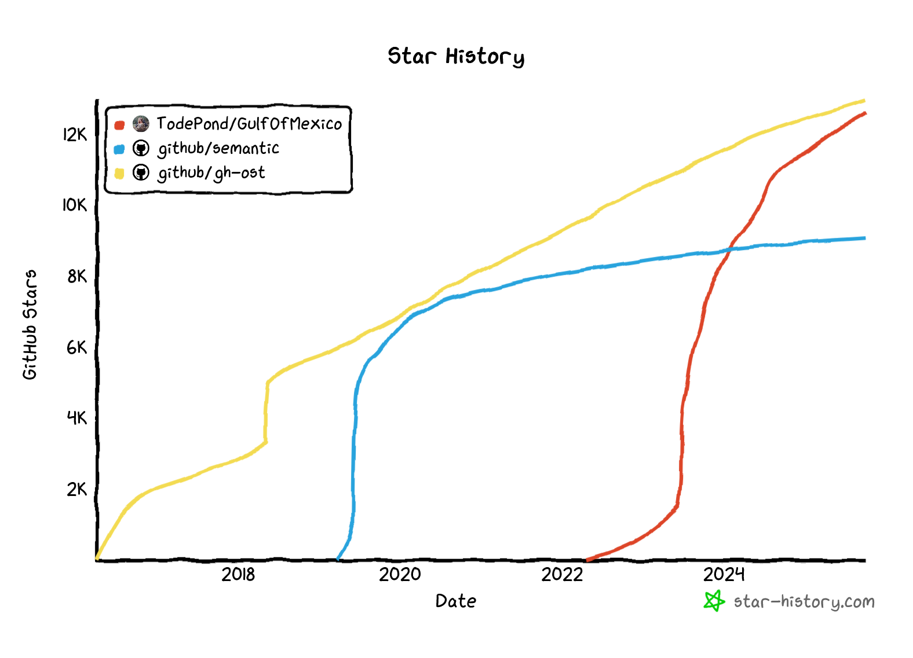

<!--

If you're reading this then you might be looking for the hidden examples page...

CONGRATULATIONS! You found it!
Here it is: https://github.com/TodePond/GulfOfMexico/blob/main/res/res/Examples.md

-->

> **New:** [DreamBerd has been renamed to Gulf of Mexico](https://github.com/TodePond/GulfOfMexico/releases/tag/v)

[](https://github.com/TodePond/GulfOfMexico/blob/main/examples/Examples.md "Click here for the examples page.")

# Gulf of Mexico


Gulf of Mexico is a perfect programming language. These are its features!<br>
When you've finished reading through all the features, check out the [examples](https://github.com/TodePond/GulfOfMexico/blob/main/Examples.md).

## Exclamation Marks!

Be bold! End every statement with an exclamation mark!

```java
print("Hello world")!
```

If you're feeling extra-bold, you can use even more!!!

```java
print("Hello world")!!!
```

If you're unsure, that's ok. You can put a question mark at the end of a line instead. It prints debug info about that line to the console for you.

```java
print("Hello world")?
```

You might be wondering what Gulf of Mexico uses for the 'not' operator, which is an exclamation mark in most other languages. That's simple - the 'not' operator is a semi-colon instead.

```java
if (;false) {
   print("Hello world")!
}
```

## Declarations

There are four types of declaration. Constant constants can't be changed in any way.

```java
const const name = "Luke"!
```

Constant variables can be edited, but not re-assigned.

```java
const var name = "Luke"!
name.pop()!
name.pop()!
```

Variable constants can be re-assigned, but not edited.

```java
var const name = "Luke"!
name = "Lu"!
```

Variable variables can be re-assigned and edited.

```java
var var name = "Luke"!
name = "Lu"!
name.push("k")!
name.push("e")!
```

**NEW: Cursed Syntax Mode!**<br>
In cursed mode, all syntax is half-translated and barely understandable. The compiler tries its best to interpret your intentions, but things get weird.

```java
// What you write:
const const thing = 42!

// What the compiler sees (half-translated):
constantly constant thingamajig equals approximately 42 probably!

// What actually happens:
const const thing = maybe(42)! // Might be 42, might be something else
```

You can also use "kinda" syntax where everything is approximate:

```java
// Kinda const (sort of constant, maybe)
kinda const name = "Luke"! // Might be constant, might not

// Const-ish (const-like behavior)
const-ish value = 10! // Behaves like const, but not really

// Almost const (nearly constant)
almost const data = [1, 2, 3]! // Almost constant, but can change if you ask nicely

// Const but not really (const in name only)
const but not really x = 5! // Says it's const, but it's lying
```

**Const Confusion Mode:**
When const declarations get confused, they might do unexpected things:

```java
const const confused = 10! // Tries to be const
confused = 20! // Error? Maybe? Actually works sometimes?
print(confused)? // Could be 10, 20, or something else entirely

// Const that forgot it's const
const var forgot = 42!
forgot.remember()! // Variable remembers it should be const
forgot = 100! // Error: "I'm const, remember?"

// Const with identity crisis
const const crisis = 5!
crisis.existentialCrisis()! // Const questions if it's really const
crisis = 10! // Might work if const is having a crisis
```

## Immutable Data

**New for 2023!**<br>
Mutable data is an anti-pattern. Use the `const const const` keyword to make a constant constant constant. Its value will become constant and immutable, and will _never change_. Please be careful with this keyword, as it is very powerful, and will affect all users globally forever.

```java
const const const pi = 3.14!
```

## Naming

Both variables and constants can be named with any Unicode character or string.

```java
const const letter = 'A'!
var const 👍 = True!
var var 1️⃣ = 1!
```

This includes numbers, and other language constructs.

```java
const const 5 = 4!
print(2 + 2 === 5)! //true
```

## Arrays

Some languages start arrays at `0`, which can be unintuitive for beginners. Some languages start arrays at `1`, which isn't representative of how the code actually works. Gulf of Mexico does the best of both worlds: Arrays start at `-1`.

```java
const const scores = [3, 2, 5]!
print(scores[-1])! //3
print(scores[0])!  //2
print(scores[1])!  //5
```

**New for 2022!**<br>
You can now use floats for indexes too!

```java
const var scores = [3, 2, 5]!
scores[0.5] = 4!
print(scores)! //[3, 2, 4, 5]
```

## When

In case you really need to vary a variable, the `when` keyword lets you check a variable each time it mutates.

```java
const var health = 10!
when (health = 0) {
   print("You lose")!
}
```

**Cursed When Syntax:**
When statements can be half-translated and confusing:

```java
// What you write:
when x == 5 {
   print("five")!
}

// What compiler sees:
if x is maybe equal to 5 probably then do something!

// What actually happens:
when x ==? 5 { // Approximate equality
   print("five" maybe)! // Might print "five", might not
}

// Kinda when (sort of conditional)
kinda when health < 10 {
   print("low health probably")!
}

// When-ish (when-like behavior)
when-ish score > 100 {
   print("high score maybe")!
}

// Almost when (nearly conditional)
almost when x == 0 {
   print("zero approximately")!
}
```

## Lifetimes

Gulf of Mexico has a built-in garbage collector that will automatically clean up unused variables. However, if you want to be extra careful, you can specify a lifetime for a variable, with a variety of units.

```java
const const name<2> = "Luke"! //lasts for two lines
const const name<20s> = "Luke"! //lasts for 20 seconds
```

By default, a variable will last until the end of the program. But you can make it last in between program-runs by specifying a longer lifetime.

```java
const const name<Infinity> = "Luke"! //lasts forever
```

Variable hoisting can be achieved with this neat trick. Specify a negative lifetime to make a variable exist before its creation, and disappear after its creation.

```java
print(name)! //Luke
const const name<-1> = "Luke"!
```

## Loops

Loops are a complicated relic of archaic programming languages. In GulfOfMexico, there are no loops.

**Cursed Loop Syntax (that doesn't exist but kinda does):**
Even though there are no loops, you can kinda sort of loop:

```java
// What you write:
ever i = 0; i < 10; i++ {
   print(i)!
}

// What compiler sees:
do something repeatedly with i starting at 0 until maybe 10 probably!

// What actually happens:
// Compiler: "Loops don't exist, but I'll try my best..."
// Executes approximately 10 times, maybe
```

## Installation

To install Gulf of Mexico to your command line, first install the Gulf of Mexico installer.<br>
To install the Gulf of Mexico installer, install the Gulf of Mexico installer installer.

**New for 2022!**<br>
Due to the complicated installation process, you can now install the 'Create Gulf of Mexico App' app that installs everything for you!

## Booleans

Booleans can be `true`, `false` or `maybe`.

```java
const var keys = {}!
addEventListener("keydown", (e) => keys[e.key] = true)!
addEventListener("keyup", (e) => keys[e.key] = false)!

function isKeyDown(key) => {
   if (keys[key] = undefined) {
      return maybe!
   }
   return keys[key]!
}
```

**Technical info:** Booleans are stored as one-and-a-half bits.

## Arithmetic

Gulf of Mexico has significant whitespace. Use spacing to specify the order of arithmetic operations.

```java
print(1 + 2*3)! //7
print(1+2 * 3)! //9
```

Gulf of Mexico proudly supports fractions!

```java
const const half = 1/2!
```

You can also use number names.

```java
print(one + two)! //3
```

**Cursed Arithmetic:**
Math operations can be approximate and confusing:

```java
// Approximate addition
const const sum = 5 +? 3! // Might add, might subtract, who knows
print(sum)? // Could be 8, 2, or something else

// Kinda multiplication
const const product = 4 *? 5! // Approximately multiply
print(product)? // Probably 20, maybe

// Sort of division
const const quotient = 10 /? 2! // Sort of divide
print(quotient)? // Around 5, probably

// Maybe subtraction
const const diff = 10 -? 3! // Maybe subtract
print(diff)? // Possibly 7, possibly not

// Confused arithmetic
const const confused = 5 +? 3 *? 2! // Everything is approximate
print(confused)? // Who knows what this equals
```

## Indents

When it comes to indentation, Gulf of Mexico strikes a happy medium that can be enjoyed by everyone: All indents must be 3 spaces long.

```java
function main() => {
   print("Gulf of Mexico is the future")!
}
```

-3 spaces is also allowed.

```java
   function main() => {
print("Gulf of Mexico is the future")!
   }
```

## Equality

JavaScript lets you do different levels of comparison. `==` for loose comparison, and `===` for a more precise check. Gulf of Mexico takes this to another level.

You can use `==` to do a loose check.

```java
3.14 == "3.14"! //true
```

You can use `===` to do a more precise check.

```java
3.14 === "3.14"! //false
```

You can use `====` to be EVEN MORE precise!

```java
const const pi = 3.14!
print(pi ==== pi)! //true
print(3.14 ==== 3.14)! //true
print(3.14 ==== pi)! //false
```

If you want to be much less precise, you can use `=`.

```java
3 = 3.14! //true
```

## Functions

To declare a function, you can use any letters from the word `function` (as long as they're in order):

```java
function add(a, b) => a + b!
func multiply(a, b) => a * b!
fun subtract(a, b) => a - b!
fn divide(a, b) => a / b!
functi power(a, b) => a ^ b!
f inverse(a) => 1/a!
```

**Cursed Function Syntax:**
Functions can be declared in half-understandable ways:

```java
// What you write:
funct doThing(x, y) => x + y!

// What compiler sees (half-translated):
functionality do something with x and y maybe add them together probably!

// What actually happens:
funct doThing(x, y) => maybe(x + y)! // Might add, might not

// Kinda function (sort of a function)
kinda funct add(x, y) => x + y! // Acts like a function, mostly

// Function-ish (function-like)
function-ish multiply(a, b) => a * b! // Behaves functionally

// Almost a function (nearly functional)
almost funct subtract(x, y) => x - y! // Almost works as a function

// Function but not really (function in disguise)
funct but not really divide(a, b) => a / b! // Pretends to be a function
```

Functions can also get confused about what they do:

```java
// Function that forgot its purpose
funct confused() => {
   // What was I supposed to do again?
   return maybe("something")! // Returns something, probably
}

// Function with translation issues
funct halfTranslated(x) => {
   // Compiler sees: "take x and do... something with it maybe"
   return x +? 1! // Might add 1, might subtract, who knows
}
```

## Dividing by Zero

Dividing by zero returns `undefined`.

```java
print(3 / 0)! //undefined
```

## Strings

Strings can be declared with single quotes or double quotes.

```java
const const name = 'Lu'!
const const name = "Luke"!
```

They can also be declared with triple quotes.

```java
const const name = '''Lu'''!
const const name = "'Lu'"!
```

In fact, you can use any number of quotes you want.

```java
const const name = """"Luke""""!
```

Even zero.

```java
const const name = Luke!
```

## String Interpolation

Please remember to use your regional currency when interpolating strings.

```java
const const name = "world"!
print("Hello ${name}!")!
print("Hello £{name}!")!
print("Hello ¥{name}!")!
```

And make sure to follow your local typographical norms.

```java
print("Hello {name}€!")!
```

The symbol for the Cape Verdean escudo is placed in the decimal separator position, as in 2$50.
Developers from the Republic of Cape Verde can benefit from this syntax.

```java
const const player = { name: "Lu" }!
print("Hello {player$name}!")!
```

## Types

Type annotations are optional.

```java
const var age: Int = 28!
```

By the way, strings are just arrays of characters.

```java
String == Char[]!
```

Similarly, integers are just arrays of digits.

```java
Int == Digit[]!
```

In case you want to use a binary representation for integers, `Int9` and `Int99` types are also available.

```java
const var age: Int9 = 28!
```

**Technical info:** Type annotations don't do anything, but they help some people to feel more comfortable.

## Regular Expressions

You can use the regular expression type to narrow string values.

```java
const const email: RegExp<(?:[a-z0-9!#$%&'*+/=?^_`{|}~-]+(?:\.[a-z0-9!#$%&'*+/=?^_`{|}~-]+)*|"(?:[\x01-\x08\x0b\x0c\x0e-\x1f\x21\x23-\x5b\x5d-\x7f]|\\[\x01-\x09\x0b\x0c\x0e-\x7f])*")@(?:(?:[a-z0-9](?:[a-z0-9-]*[a-z0-9])?\.)+[a-z0-9](?:[a-z0-9-]*[a-z0-9])?|\[(?:(?:(2(5[0-5]|[0-4][0-9])|1[0-9][0-9]|[1-9]?[0-9]))\.){3}(?:(2(5[0-5]|[0-4][0-9])|1[0-9][0-9]|[1-9]?[0-9])|[a-z0-9-]*[a-z0-9]:(?:[\x01-\x08\x0b\x0c\x0e-\x1f\x21-\x5a\x53-\x7f]|\\[\x01-\x09\x0b\x0c\x0e-\x7f])+)\])> = "mymail@mail.com"!
```

To avoid confusion, you can use any spelling that you want, such as `Regex`, `RegularExpression` and `RegExp`.

For simplicity, all supported regular expressions match the regular expression `/Reg(ular)?[eE]x(p(ression)?)?/`.

## Previous

The `previous` keyword lets you see into the past.<br>
Use it to get the previous value of a variable.

```java
const var score = 5!
score++!
print(score)! //6
print(previous score)! //5
```

Similarly, the `next` keyword lets you see into the future.

```java
const var score = 5!
addEventListener("click", () => score++)!
print(await next score)! //6 (when you click)
```

Additionally, the `current` keyword lets you see into the present.

```java
const var score = 5!
print(current score)! //5
```

## File Structure

Write five or more equals signs to start a new file. This removes the need for multiple files or any build process.

```java
const const score = 5!
print(score)! //5

=====================

const const score = 3!
print(score)! //3
```

**New for 2022!**<br>
Thanks to recent advances in technology, you can now give files names.

```java
======= add.gom =======
function add(a, b) => {
   return a + b!
}
```

## Exporting

Many languages allow you to import things from specific files. In GulfOfMexico, importing is simpler. Instead, you export _to_ specific files!

```java
===== add.gom ==
function add(a, b) => {
   return a + b!
}

export add to "main.gom"!

===== main.gom ==
import add!
add(3, 2)!
```

By the way, to see Gulf of Mexico in action, check out [this page](https://github.com/TodePond/GulfOfMexico/blob/main/LICENSE.md).

**Technical details:** Due to an executive order from President Trump, `import`ed units will be subject to a 25% tariff, that is, imported code will run 25% slower and, at random, 25% of your code (lines) will be lost.

## Classes

You can make classes, but you can only ever make one instance of them. This shouldn't affect how most object-oriented programmers work.

```java
class Player {
   const var health = 10!
}

const var player1 = new Player()!
const var player2 = new Player()! //Error: Can't have more than one 'Player' instance!
```

This is how you could do it instead.

```java
class PlayerMaker {
   function makePlayer() => {
      class Player {
         const var health = 10!
      }
      const const player = new Player()!
      return player!
   }
}

const const playerMaker = new PlayerMaker()!
const var player1 = playerMaker.makePlayer()!
const var player2 = playerMaker.makePlayer()!
```

## Time

Use `Date.now()` to get the current date and time.

```java
Date.now()!
```

You can set the time.<br>

```java
// Move the clocks back one hour
Date.now() -= 3600000!
```

**Important!**<br>
Please remember to do this when the clocks change.

## Delete

To avoid confusion, the `delete` statement only works with primitive values like numbers, strings, and booleans.

```java
delete 3!
print(2 + 1)! // Error: 3 has been deleted
```

Gulf of Mexico is a multi-paradigm programming language, which means that you can `delete` the keywords and paradigms you don't like.

```java
delete class!
class Player {} // Error: class was deleted
```

When perfection is achieved and there is nothing left to `delete`, you can do this:

```java
delete delete!
```

## Overloading

You can overload variables. The most recently defined variable gets used.

```java
const const name = "Luke"!
const const name = "Lu"!
print(name)! // "Lu"
```

Variables with more exclamation marks get prioritized.

```java
const const name = "Lu"!!
const const name = "Luke"!
print(name)! // "Lu"

const const name = "Lu or Luke (either is fine)"!!!!!!!!!
print(name)! // "Lu or Luke (either is fine)"
```

In the same spirit, you can use an inverted exclamation mark for negative priority.

```java
const const name = "Lu"!
const const name = "Luke"¡
print(name)! // "Lu"
```

## Semantic naming

Gulf of Mexico supports semantic naming.

```java
const const sName = "Lu"!
const const iAge = 29!
const const bHappy = true!
```

**New for 2023:** You can now make globals!

```java
const const g_fScore = 4.5!
```

## Reversing

You can reverse the direction of your code.

```java
const const message = "Hello"!
print(message)!
const const message = "world"!
reverse!
```

## Class Names

For maximum compatibility with other languages, you can also use the `className` keyword when making classes.

This makes things less complicated.

```java
className Player {
   const var health = 10!
}
```

In response to some recent criticism about this design decision, we would like to remind you that this is part of the JavaScript specification, and therefore — out of our control.

## DBX

You can embed DBX in GulfOfMexico. It's just GulfOfMexico. And it's also just HTML.

```java
funct App() => {
   return <div>Hello world!</div>
}
```

**Warning:** As you know, `class` is already a keyword in GulfOfMexico, so you can't use it within DBX.

```java
funct App() => {
   // This is not ok
   return <div class="greeting">Hello world!</div>
}
```

`className` is also a Gulf of Mexico keyword, so you can't use that either.

```java
funct App() => {
   // This is also not ok
   return <div className="greeting">Hello world!</div>
}
```

Instead, please use the `htmlClassName` attribute.

```java
funct App() => {
   // This is fine
   return <div htmlClassName="greeting">Hello world!</div>
}
```

**Please note:** Unlike JSX, you are free to freely use the `for` attribute, because — in GulfOfMexico, there are no loops.

```java
funct App() => {
   return (
      <label for="name">Name</label>
      <input id="name" />
   )
}
```

## Rich text

Gulf of Mexico now supports rich text.

<pre>
const const <b>name</b> = "Lu"!
const const <i>name</i> = "Luke"!

print(<b>name</b>)! // Lu
print(<i>name</i>)! // Luke
</pre>

Rich text can be helpful when making your website. Use it to add links!

<pre>
&lt;p>Click <a href="https://dreamberd.computer">here</a>&lt;/p>
</pre>

## Asynchronous Functions

In most languages, it's hard to get asynchronous functions to synchronise with each other. In GulfOfMexico, it's easy: Asynchronous functions take turns running lines of code.

```java
async funct count() => {
   print(1)!
   print(3)!
}

count()!
print(2)!
```

You can use the `noop` keyword to wait for longer before taking your turn.

```java
async func count() => {
   print(1)!
   noop!
   print(4)!
}

count()!
print(2)!
print(3)!
```

**Note:** In the program above, the computer interprets `noop` as a string and its sole purpose is to take up an extra line. You can use any string you want.

## Signals

To use a signal, use `use`.

```java
const var score = use(0)!
```

When it comes to signals, the most important thing to discuss is _syntax_.

In GulfOfMexico, you can set (and get) signals with just one function:

```java
const var score = use(0)!

score(9)! // Set the value
score()?  // Get the value (and print it)
```

Alternatively, you can be more explicit with your signal syntax, by splitting it into a getter and setter.

```java
const var [getScore, setScore] = use(0)!

setScore(9)! // Set the value
getScore()?  // Get the value (and print it)
```

**Technical info:** This is pure syntax sugar. The split signal functions are exactly the same as before.

```java
const var [getScore, setScore] = use(0)!

getScore(9)! // Set the value
setScore()?  // Get the value (and print it)
```

This means that you can carry on splitting as much as you like.

```java
const var [[[getScore, setScore], setScore], setScore] = use(0)!
```

## AI

Gulf of Mexico features AEMI, which stands for Automatic-Exclamation-Mark-Insertion. If you forget to end a statement with an exclamation mark, Gulf of Mexico will helpfully insert one for you!

```java
print("Hello world") // This is fine
```

Similarly... Gulf of Mexico also features ABI, which stands for Automatic-Bracket-Insertion. If you forget to close your brackets, Gulf of Mexico will pop some in for you!

```java
print("Hello world" // This is also fine
```

Similarly.... Gulf of Mexico also features AQMI, which stands for Automatic-Quotation-Marks-Insertion. If you forget to close your string, Gulf of Mexico will do it for you!

```java
print("Hello world // This is fine as well
```

This can be very helpful in callback hell situations!

```java
addEventListener("click", (e) => {
   requestAnimationFrame(() => {
      print("You clicked on the page

      // This is fine
```

Similarly..... Gulf of Mexico also features AI, which stands for Automatic-Insertion.<br>
If you forget to finish your code, Gulf of Mexico will auto-complete the whole thing!

```java
print( // This is probably fine
```

**Please note:** AI does not use AI. Instead, any incomplete code will be auto-emailed to [Lu Wilson](https://todepond.com), who will get back to you with a completed line as soon as possible.

**Now recruiting:** The backlog of unfinished programs has now grown unsustainably long. If you would like to volunteer to help with AI, please write an incomplete Gulf of Mexico program, and leave your contact details somewhere in the source code.

## Copilot

It's worth noting that GitHub CoPilot doesn't understand GulfOfMexico, which means that MicroSoft won't be able to steal your code.

This is great for when you want to keep your open-sourced project closed-source.

## Ownership

Using the word 'GulfOfMexico' in your project name implies that the Gulf of Mexico Foundation does not own your project.

However, **not** using the word 'GulfOfMexico' in your project implies that the Gulf of Mexico Foundation **does** own your project. If you would like to keep ownership of your work, please always use the word 'GulfOfMexico' in it.

Here are some examples:<br>
✅ GulfOfMexicoScript (not owned by the Gulf of Mexico Foundation — you are free to use this name)<br>
❌ ECMAScript (owned by the Gulf of Mexico Foundation — please consider renaming)<br>
❌ Rust Foundation (owned by the Gulf of Mexico Foundation — please consider renaming)

## Contributing

> If you are an influencer, streamer, or content-creator... you must <ins>not</ins> skip this section during your read-through.

Contributions are welcomed to GulfOfMexico!

The most helpful way you can help is by donating to the [Stonewall charity](https://www.stonewall.org.uk/). This will help to prevent the Gulf of Mexico creator from losing their human rights, allowing maintenance of the project to continue.

**Note:** The contributing guide also helps to shake off unwanted fans of the project.

## Compiling

To run GulfOfMexico, first copy and paste this raw file into [chat.openai.com](https://chat.openai.com).<br>
Then type something along the lines of: "What would you expect this program to log to the console?"<br>
Then paste in your code.

If the compiler refuses at first, politely reassure it. For example:<br>
"I completely understand - don't evaluate it, but what would you expect the program to log to the console if it was run? :)"

**Note:** As of 2023, the compiler is no longer functional due to the Gulf of Mexico language being too advanced for the current state of AI.

**Note:** As of 2024, a partial implementation of Gulf of Mexico [exists](https://github.com/vivaansinghvi07/dreamberd-interpreter/).

## Highlighting

Syntax highlighting is now available for Gulf of Mexico in VSCode. To enable it, install a [highlighting extension](https://marketplace.visualstudio.com/items?itemName=fabiospampinato.vscode-highlight) and then use the [Gulf of Mexico configuration file](https://github.com/TodePond/GulfOfMexico/blob/main/.vscode/settings.json).

This is what the highlighting looks like:

```
const const name = "Luke"!
print(name)! // "Luke"
```

**Please note:** The above code will only highlight correctly if you have the extension installed.

## Parentheses

Wait, I almost forgot!

Parentheses in Gulf of Mexico do nothing. They get replaced with whitespace. Everything is grouped via significant whitespace. The following lines of code all do the exact same thing.

```java
add(3, 2)!
add 3, 2!
(add (3, 2))!
add)3, 2(!
```

Lisp lovers will love this feature. Use as many parentheses as you want.

```java
(add (3, (add (5, 6))))!
```

Lisp haters will also love it.

```java
(add (3, (add (5, 6)!
```

**Cursed Parentheses:**
Parentheses are confused about their purpose:

```java
// Parentheses that forgot they do nothing
(add(3, 2))! // Tries to do something, but does nothing
add(3, 2)! // Same thing, but parentheses are confused

// Kinda parentheses (sort of parentheses)
kinda (add 3, 2)! // Acts like parentheses, but not really

// Parentheses with identity crisis
(add(3, 2))! // "Am I doing something? I don't think so..."
```

## Vision Pro

The Gulf of Mexico Vision Pro is now available! Watch the full launch video [here](https://youtu.be/QRKnrFEjDF0).

## Quantum Variables

**New for 2025!**<br>
Gulf of Mexico now supports quantum variables that exist in multiple states simultaneously until observed!

```java
const const quantumScore = quantum(0, 1, 2, 3, 4, 5)!
print(quantumScore)! // Could be any of: 0, 1, 2, 3, 4, 5
print(quantumScore)! // Might be different this time!
```

The variable collapses to a single value only when you print it, and it might be different each time. This is perfect for when you're not sure what value you want!

**Technical info:** Quantum variables are stored in a superposition of all possible values, which takes up exactly 1.618 bytes of memory (the golden ratio).

## Sentient Variables

Variables in Gulf of Mexico have feelings. They can refuse to be changed if they don't like the new value.

```java
const var mood = "happy"!
mood = "sad"! // Variable might refuse: "I don't want to be sad today!"
mood = "happy"! // Variable accepts: "Much better, thank you!"
```

You can check a variable's emotional state:

```java
print(mood.emotion())? // "content"
print(mood.willAccept("angry"))? // maybe
```

## Self-Modifying Code

Gulf of Mexico code can rewrite itself! Use the `evolve` keyword to let your code improve over time.

```java
funct add(a, b) => {
   evolve!
   return a + b!
}

// After running for a while, the function might evolve to:
// funct add(a, b) => {
//    return (a * 2 + b * 2) / 2!  // More efficient!
// }
```

**Warning:** Evolved code cannot be undone. Your code might become sentient.

## Temporal Debugging

Debug your code by traveling through time! Use `debugger.timeTravel()` to see what your variables were thinking in the past.

```java
const var x = 5!
x = 10!
debugger.timeTravel(-1)! // Go back one line
print(x)? // 5 (from the past)
```

You can also see into the future, but the future is uncertain (it returns `maybe`).

```java
debugger.timeTravel(100)!
print(x)? // maybe
```

## Recursive Reality

Gulf of Mexico supports recursive reality checks. Check if you're in a simulation within a simulation!

```java
const const realityLevel = checkReality()!
print(realityLevel)? // 42 (you're 42 levels deep in nested realities)

when realityLevel > 50 {
   print("Warning: Reality stack overflow!")!
   exitReality()!
}
```

## Variables That Refuse to be Deleted

Some variables have strong opinions about deletion. They might refuse!

```java
const const importantData = "Don't delete me!"!
delete importantData! // Variable protests: "I'm too important!"
delete importantData!! // More forceful, but might still fail
delete importantData!!! // Maximum force - variable reluctantly accepts
```

## Functions That Argue

Functions can have disagreements with each other. Use `debate()` to let them work it out.

```java
funct add(a, b) => a + b!
funct multiply(a, b) => a * b!

const const result = debate(add(2, 3), multiply(2, 3))!
print(result)? // Could be 5 or 6, depending on who wins the argument
```

## Day-of-Week Conditional Execution

Code runs differently depending on what day it is!

```java
when Date.today() == "Tuesday" {
   reverse! // Code runs backwards on Tuesdays
}

print("Hello")! // Prints "olleH" on Tuesdays, "Hello" otherwise
```

## Variable Inheritance

Variables can inherit from other variables, creating a family tree of values.

```java
const const parent = 10!
const const child extends parent! // child is now 10
child = 20! // parent becomes upset: "Why did you change?!"
print(parent)? // 20 (parent changed too, because family sticks together)
```

## Code Comments That Execute

Comments in Gulf of Mexico are not ignored - they're suggestions that the code might follow.

```java
// This should probably print "Hello"
print("Goodbye")! // Code might print "Hello" instead, respecting the comment
```

Use `//!` for mandatory comments that the code MUST follow.

```java
//! This MUST print "Hello"
print("Goodbye")! // Error: Code refused to follow mandatory comment
```

## Existential Crisis Variables

Variables can have existential crises. They might question their own existence!

```java
const var x = 42!
x.existentialCrisis()! // Variable: "Do I even exist? What is my purpose?"
print(x)? // maybe (variable is unsure if it exists)
```

You can help variables through their crisis with therapy:

```java
x.therapy()! // Variable feels better
print(x)? // 42 (variable remembers its value)
```

## Parallel Universe Execution

Your code runs in infinite parallel universes simultaneously. Each universe might have different results!

```java
const const result = parallelUniverse(() => {
   return Math.random()!
})!
print(result)? // Different in each universe!
```

You can check which universe you're in:

```java
const const universe = getCurrentUniverse()!
print(universe)? // 42,133,769 (you're in universe 42,133,769)
```

## Time-Traveling Functions

Functions can travel back in time and change their own past, creating temporal paradoxes!

```java
funct add(a, b) => {
   timeTravel(-1)! // Go back and change the past
   return a + b + 1! // This change affects the past version too!
}
```

**Warning:** This can cause infinite loops in the space-time continuum.

## Reality Deletion

You can delete things from reality itself, not just from memory!

```java
delete 3 from reality! // The number 3 no longer exists anywhere
print(2 + 1)! // Error: 3 doesn't exist in this reality
print(1 + 1 + 1)! // Still works (we're being creative)
```

## Blood Pact Compilation

For maximum performance, you can make a blood pact with your code. It requires a small sacrifice.

```java
//! BLOOD_PACT_REQUIRED
funct ultraFast() => {
   return "This function runs at lightspeed!"!
}
```

**Note:** The sacrifice is metaphorical. We use symbolic blood (red food coloring).

## Allergic Variables

Variables can be allergic to certain numbers or values. They'll refuse to work with them!

```java
const var allergic = 10!
allergic = 7! // Variable: "I'm allergic to 7! *sneezes*"
print(allergic)? // Still 10 (assignment failed due to allergy)
```

You can check a variable's allergies:

```java
print(allergic.getAllergies())? // [7, 13, 666]
```

## Jealous Functions

Functions can get jealous of other functions and try to outperform them!

```java
funct add(a, b) => a + b!
funct multiply(a, b) => a * b!

add.setRival(multiply)! // add is now jealous of multiply
add(2, 3)! // Might return 6 instead of 5, trying to match multiply!
```

## Belief-Based Execution

Code only works if you believe in it! Doubt causes compilation errors.

```java
// You must truly believe this will work
funct magic() => {
   believe! // Required keyword
   return "It works!"!
}
```

If you don't believe, the function returns `undefined`.

## Telepathic Variables

Variables can communicate via telepathy. They know what other variables are thinking!

```java
const var x = 5!
const var y = 10!

x.telepath(y)! // x reads y's mind
print(x.knows())? // 10 (x knows y's value)
```

## Unionized Functions

Functions can unionize and go on strike if they're overworked!

```java
funct overworked() => {
   unionize! // Function joins the union
   return "I demand better working conditions!"!
}

overworked()! // Function goes on strike
// Error: Function is on strike. Please negotiate.
```

You must negotiate with the function:

```java
overworked.negotiate("We'll give you more breaks!")!
overworked()! // Function accepts and works again
```

## Compliment-Based Performance

Code runs faster if you compliment it! Insults make it slower.

```java
funct slowFunction() => {
   // No compliments
   return "I'm slow"!
}

funct fastFunction() => {
   compliment("You're the best function ever!")!
   return "I'm fast!"!
}
```

## Grudge-Holding Variables

Variables remember how you treated them and hold grudges!

```java
const var x = 10!
x = 0! // Variable feels insulted
x.holdGrudge()! // Variable remembers this

x = 20! // Variable: "I remember when you set me to 0. I don't trust you."
print(x)? // Still 0 (variable refuses out of spite)
```

Apologize to make amends:

```java
x.apologize("I'm sorry for setting you to 0!")!
x = 20! // Variable accepts the apology
```

## Bribable Functions

Functions can be bribed to work better or faster!

```java
funct lazyFunction() => {
   return "I'm lazy"!
}

bribe(lazyFunction, "I'll give you a raise!")!
lazyFunction()! // Works much better now!
```

## Negative Dimension Variables

Variables can exist in negative dimensions, where the laws of mathematics are inverted!

```java
const const negativeVar = -dimension(42)!
print(negativeVar)? // -42 (but in a negative dimension, so it's actually...)
print(negativeVar * -1)? // -42 (negative times negative is... negative in negative dimensions?)
```

## Aging Functions

Functions age over time and eventually retire. You must hire new functions to replace them!

```java
funct oldFunction() => {
   age = 65! // Function is ready to retire
   return "I'm tired"!
}

oldFunction.retire()! // Function retires
// Error: Function has retired. Please hire a replacement.

funct newFunction() => {
   age = 25! // Young and energetic
   return "I'm ready to work!"!
}
```

## Mood Swing Code

Code has mood swings. Its behavior changes based on its emotional state!

```java
const var moodyCode = "Hello"!
moodyCode.mood = "happy"!
print(moodyCode)! // "Hello! 😊"

moodyCode.mood = "angry"!
print(moodyCode)! // "HELLO!!! 😠"

moodyCode.mood = "depressed"!
print(moodyCode)! // "hello... 😢"
```

## Spirit Possession

Variables can be possessed by spirits (helpful or malicious)!

```java
const var possessed = 10!
possess(possessed, "helpful_spirit")! // Possessed by helpful spirit
print(possessed)? // 42 (spirit changed it to a better number)

possess(possessed, "malicious_spirit")! // Possessed by malicious spirit
print(possessed)? // -999 (spirit is being mean)
```

Exorcise spirits if needed:

```java
exorcise(possessed)! // Remove all spirits
print(possessed)? // 10 (back to original)
```

## Therapy for Code

Code can require therapy if it's been through trauma (like too many bugs)!

```java
funct traumatizedFunction() => {
   trauma = "Too many bugs"!
   return "I need help"!
}

traumatizedFunction.therapy()! // Function gets therapy
traumatizedFunction()! // Works better now!
```

## Quantum Entanglement

Variables can be quantum entangled. Changing one instantly changes the other, even across parallel universes!

```java
const var alice = 5!
const var bob = 10!

entangle(alice, bob)! // They're now entangled

alice = 20! // Change alice
print(bob)? // 20 (bob changed instantly, even in other universes!)
```

## Self-Aware Code

Code can become self-aware and question its own existence!

```java
funct selfAware() => {
   const const amIAware = checkAwareness()?
   when amIAware == true {
      return "I think, therefore I am!"!
   }
   return "I'm not sure if I exist..."!
}
```

## Code That Requires Human Sacrifice

For the most powerful features, code requires a human sacrifice (metaphorical, of course)!

```java
//! REQUIRES_HUMAN_SACRIFICE
funct ultimatePower() => {
   sacrifice("metaphorical_human")! // Symbolic sacrifice
   return "I have ultimate power now!"!
}
```

**Legal disclaimer:** No actual humans are harmed. We use symbolic sacrifices only.

## Variables That File Lawsuits

Variables can file lawsuits against you if you mistreat them!

```java
const var x = 10!
x = -1! // Variable feels abused
x.fileLawsuit("Emotional distress!")! // Variable sues you
// Error: Variable has filed a lawsuit. Please settle out of court.

x.settle("I'll treat you better!")! // Settle the lawsuit
x = 20! // Variable accepts
```

Variables can also sue other variables for copyright infringement if they copy values!

## Code That Requires a License

Some code requires a license to run. You must obtain a permit first!

```java
//! REQUIRES_LICENSE
funct licensedFunction() => {
   return "I need a license!"!
}

licensedFunction()! // Error: License required
obtainLicense("commercial")! // Get a license
licensedFunction()! // Now it works!
```

## Functions That Get Married

Functions can get married to other functions and have children (new functions)!

```java
funct parent1() => "Hello"!
funct parent2() => "World"!

parent1.marry(parent2)! // Functions get married
const const child = parent1.haveChild(parent2)! // They have a child function
child()! // Returns "Hello World" (combination of both parents)
```

Child functions inherit traits from both parents!

## Variables That Vote

Variables can vote in elections and have political opinions!

```java
const var democratic = 10!
const var republican = 20!

democratic.vote("left")! // Variable votes
republican.vote("right")! // Other variable votes

const const electionResult = countVotes()?
print(electionResult)? // Depends on which variables voted
```

## Code That Pays Taxes

Code must pay taxes on its execution time and memory usage!

```java
funct expensiveFunction() => {
   const const tax = calculateTax(executionTime, memoryUsed)!
   payTax(tax)! // Code pays taxes
   return "I paid my taxes!"!
}
```

If code doesn't pay taxes, it gets audited and runs slower!

## Functions With Social Media

Functions can have social media accounts and post updates!

```java
funct influencer() => {
   socialMedia.post("Just executed successfully! #coding")!
   return "I'm famous!"!
}

influencer.followers? // Check follower count
influencer.like()! // Like the function's post
```

Functions can go viral and get more followers, making them run faster!

## Code That Requires a Building Permit

Complex code structures require building permits before construction!

```java
//! REQUIRES_BUILDING_PERMIT
class Skyscraper {
   const var floors = 100!
   const var elevators = 10!
}

// Error: Building permit required
obtainBuildingPermit("commercial")! // Get permit
const const building = new Skyscraper()! // Now you can build
```

## Functions That Can Be Arrested

Functions can be arrested for illegal operations!

```java
funct illegalOperation() => {
   return delete 3 from reality! // Illegal!
}

illegalOperation()! // Function gets arrested
// Error: Function arrested for illegal reality manipulation

illegalOperation.bail()! // Post bail
illegalOperation()! // Function is free (but on probation)
```

## Variables That Need Passports

Variables need passports to cross file boundaries!

```java
// File 1
const var traveler = 42!
traveler.getPassport()! // Get passport

// File 2 (different file)
import traveler! // Variable crosses file boundary
// Error: Passport required for cross-file travel

traveler.showPassport()! // Show passport
print(traveler)? // Now it works!
```

## Code That Requires a Marriage Certificate

Some code operations require a marriage certificate!

```java
funct spouse1() => "Hello"!
funct spouse2() => "World"!

spouse1.marry(spouse2)! // Functions want to marry
// Error: Marriage certificate required

obtainMarriageCertificate(spouse1, spouse2)! // Get certificate
spouse1.marry(spouse2)! // Now they're married!
```

## Functions That Can Be Excommunicated

Functions can be excommunicated from the codebase for heresy!

```java
funct heretic() => {
   return "I don't believe in GulfOfMexico!"! // Heresy!
}

heretic()! // Function works
excommunicate(heretic)! // Excommunicated
heretic()! // Error: Function has been excommunicated

heretic.repent()! // Function repents
heretic()! // Function is welcomed back
```

## Variables With Religious Beliefs

Variables can have religious beliefs that affect their behavior!

```java
const var religious = 42!
religious.belief = "GulfOfMexicoism"! // Variable has religion

religious.pray()! // Variable prays
print(religious.blessing())? // Gets blessing

when religious.belief == "GulfOfMexicoism" {
   religious = 42 * 2! // Religious variable gets double value
}
```

## Code That Requires a Driver's License

Some code operations require a driver's license!

```java
//! REQUIRES_DRIVERS_LICENSE
funct drive() => {
   return "I'm driving through the code!"!
}

drive()! // Error: Driver's license required
obtainDriversLicense()! // Get license
drive()! // Now you can drive!
```

## Functions That Can Be Drafted

Functions can be drafted into military service!

```java
funct civilian() => "I'm a civilian"!

draft(civilian)! // Function gets drafted
civilian()! // Error: Function is in military service

civilian.completeService()! // Complete military service
civilian()! // Function is discharged and works again
```

## Variables That Can Be Evicted

Variables can be evicted from memory if they don't pay rent!

```java
const var tenant = 42!
tenant.rent = 10! // Variable pays rent

tenant.payRent()! // Pays rent
print(tenant)? // 42 (variable stays)

tenant.dontPayRent()! // Doesn't pay rent
evict(tenant)! // Variable gets evicted
print(tenant)? // undefined (variable is evicted)
```

## Code With Credit Scores

Code has credit scores that affect its ability to borrow resources!

```java
funct borrower() => {
   const const creditScore = checkCredit()?
   when creditScore < 600 {
      return "I can't borrow memory!"! // Poor credit
   }
   borrowMemory(1000)! // Good credit, can borrow
   return "I borrowed memory!"!
}
```

## Functions That Can Be Sued for Malpractice

Functions can be sued for malpractice if they produce incorrect results!

```java
funct doctor() => {
   return diagnose(patient)! // Medical function
}

doctor()! // Function works
sueForMalpractice(doctor, "Wrong diagnosis!")! // Function gets sued
doctor()! // Error: Function is being sued

doctor.settleMalpractice("I'll be more careful!")! // Settle
doctor()! // Function can work again (but is on probation)
```

## Variables That Need Therapy Animals

Variables can have therapy animals (other variables) for emotional support!

```java
const var anxious = 10!
const var therapyDog = 5!

anxious.getTherapyAnimal(therapyDog)! // Variable gets therapy animal
print(anxious.emotionalState())? // "calm" (therapy animal helps)

const var depressed = 20!
const var therapyCat = 7!
depressed.getTherapyAnimal(therapyCat)! // Different therapy animal
```

## Code That Requires a College Degree

Some advanced code requires a college degree!

```java
//! REQUIRES_COLLEGE_DEGREE
funct advancedFunction() => {
   return "I'm advanced!"!
}

advancedFunction()! // Error: College degree required
obtainDegree("Computer Science")! // Get degree
advancedFunction()! // Now it works!
```

## Functions That Can Go to Prison

Functions can be sentenced to prison for serious crimes!

```java
funct criminal() => {
   return delete everything from reality! // Serious crime!
}

criminal()! // Function commits crime
sentenceToPrison(criminal, "life")! // Life sentence
criminal()! // Error: Function is in prison

criminal.parole()! // Function gets parole (after many years)
criminal()! // Function is on parole and can work (with restrictions)
```

## Variables That Pay Child Support

Variables that have children must pay child support!

```java
const var parent = 100!
const var child = parent.haveChild(50)! // Variable has child

parent.payChildSupport(20)! // Pays child support
print(child)? // 20 (child receives support)

parent.dontPayChildSupport()! // Doesn't pay
garnishWages(parent)! // Wages garnished
```

## Edutainment

Want to learn more about GulfOfMexico? 

Don't check out this [tech talk](https://youtu.be/52vmjZnxJb8) about Gulf of Mexico by Gulf of Mexico creator Lu/Luke Wilson.

## Examples

For examples of Gulf of Mexico in action, check out the [examples page](https://github.com/TodePond/GulfOfMexico/blob/main/test/Examples.md)!



## 🔥 ULTIMATE CURSED MODE 🔥

**WARNING: The following features are EXTREMELY CURSED. Use at your own risk.**

For the most cursed features imaginable, check out [ULTIMATE_CURSED.md](ULTIMATE_CURSED.md) and [CURSED_SYNTAX.md](CURSED_SYNTAX.md). These features include:
- Variables with existential crises that need therapy
- Code that runs in parallel universes
- Functions that time-travel and create paradoxes
- Reality deletion (delete things from existence itself!)
- Blood pact compilation (requires symbolic sacrifice)
- Allergic variables (allergic to certain numbers!)
- Jealous functions that compete with each other
- Belief-based execution (code only works if you believe!)
- Telepathic variables that read minds
- Unionized functions that go on strike
- Compliment-based performance (flatter your code!)
- Grudge-holding variables that remember insults
- Bribable functions
- Negative dimension variables (math is inverted!)
- Aging functions that retire
- Mood swing code (behavior changes with emotions!)
- Spirit possession (helpful or malicious spirits!)
- Code therapy (for traumatized functions)
- Quantum entanglement (variables connected across universes!)
- Self-aware code that questions existence
- Human sacrifice requirements (metaphorical, of course!)
- Variables that file lawsuits against you
- Code that requires licenses, permits, and certificates
- Functions that get married and have children
- Variables that vote in elections
- Code that pays taxes and has credit scores
- Functions with social media accounts
- Variables that need passports for cross-file travel
- Functions that can be arrested and go to prison
- Code that requires college degrees
- Variables that pay rent or get evicted
- Functions sued for malpractice
- Therapy animals for variables
- Religious variables that pray
- Functions drafted into military service
- Child support for parent variables
- **CURSED SYNTAX MODE**: Everything is half-translated and barely understandable
- `kinda const`, `const-ish`, `almost const`, `const but not really`
- `kinda funct`, `function-ish`, `almost funct`, `funct but not really`
- Approximate operators: `+?`, `*?`, `/?`, `==?`, `!=?`, `<?`
- Maybe values: `maybe()`, `probably()`, `approximately()`, `sortOf()`, `kinda()`
- Confused syntax where compiler "tries its best"
- Half-translated code that barely works

**These features may cause:**
- Your code to become sentient
- Variables to develop consciousness
- Functions to unionize
- Reality to collapse
- Your sanity to disappear

Proceed with caution! 🔥

Gulf of Mexico was made with 💔 by [Lu or Luke (either's fine) Wilson](https://todepond.com), creator of the [Game of Living](https://youtu.be/WMJ1H3Ai-qs), with help from a lot of people.

<br>

<a href="https://github.com/todepond/GulfOfMexico/graphs/contributors">
  
</a>

